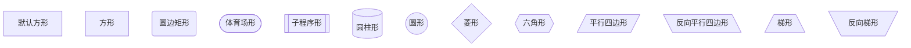
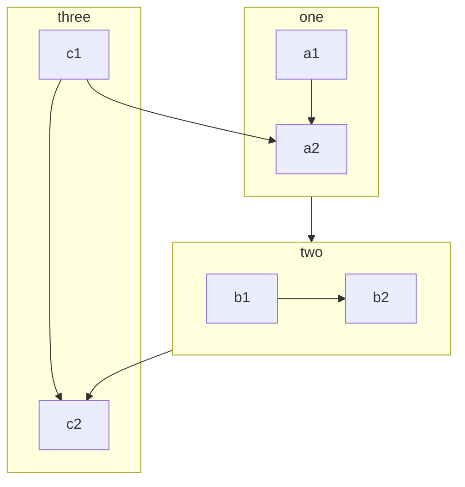
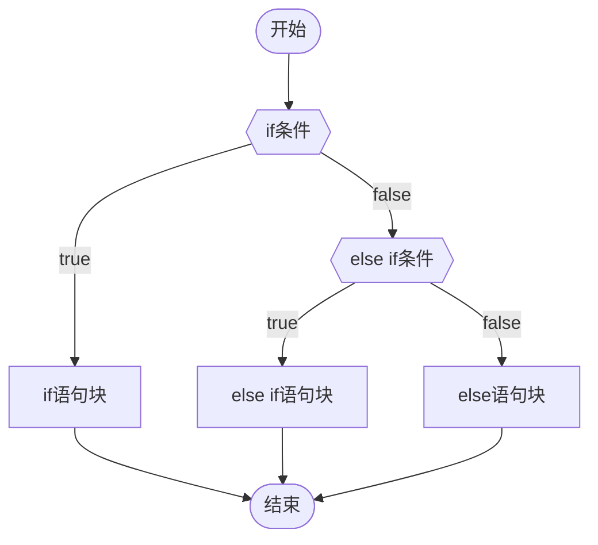
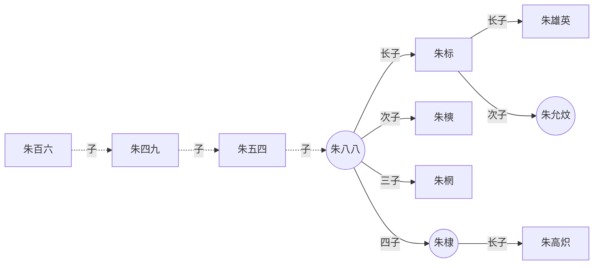
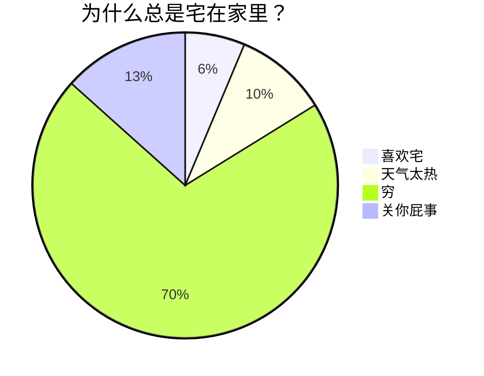
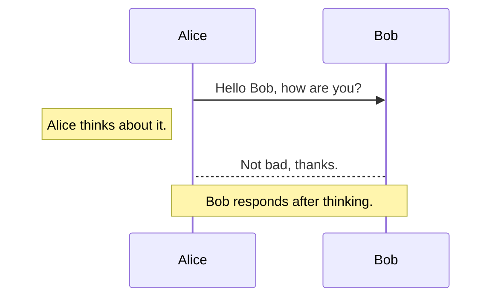
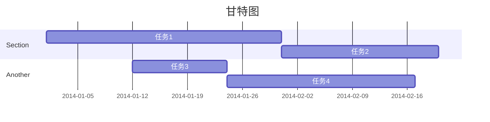
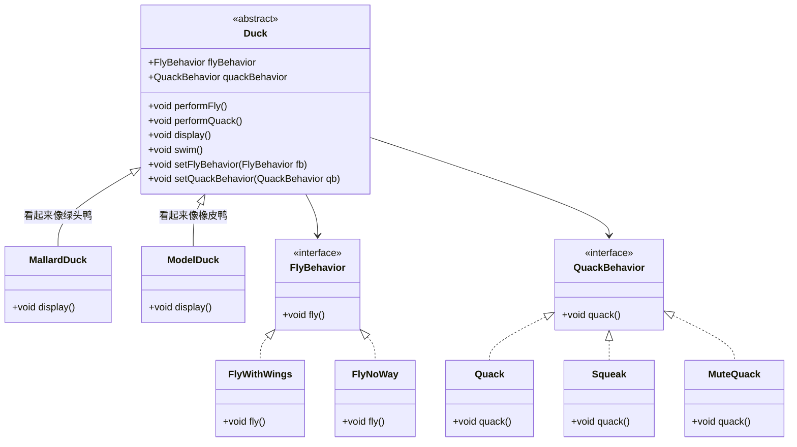

# H1 标题 - 最大级别标题
## H2 标题 - 二级标题
### H3 标题 - 三级标题
#### H4 标题 - 四级标题
##### H5 标题 - 五级标题
###### H6 标题 - 六级标题

# 段落与文本样式
这是 **粗体文本**，这是 _斜体文本_，这是 _**粗斜体文本**_

这是 ~~删除线文本~~，这是 `行内代码`，这是 ==高亮文本==

这是一个包含 [链接](https://github.com/) 的段落

# 引用
> 这是一个简单的引用。
> 
> 引用可以包含多个段落。

> ### 引用中可以包含标题
> 
> > 这是嵌套的引用内容

# 列表
## 无序列表
- 第一项
- 第二项
    - 嵌套项 1
    - 嵌套项 2
        - 更深层嵌套
- 第三项

## 有序列表
1. 第一步
2. 第二步
    1. 子步骤 2.1
    2. 子步骤 2.2
3. 第三步

## 任务列表
- [x] 已完成的任务
- [ ] 待办事项
- [ ] 另一个待办事项
    - [ ] 嵌套待办
    - [x] 嵌套已完成

# 代码块
## 行内代码
使用 `console.log()` 输出信息，或者使用 `const` 声明常量

## 代码块（无语言标识）
```
这是一个纯文本代码块
没有语法高亮
可以用于展示纯文本内容
```

```python
def fibonacci(n):
    """计算斐波那契数列"""
    if n <= 1:
        return n
    return fibonacci(n-1) + fibonacci(n-2)

# 输出前 10 个斐波那契数
for i in range(10):
    print(f"F({i}) = {fibonacci(i)}")
```

```javascript
// ES6 箭头函数示例
const greet = (name) => {
  return `Hello, ${name}!`;
};

// 使用 async/await
async function fetchData(url) {
  try {
    const response = await fetch(url);
    const data = await response.json();
    return data;
  } catch (error) {
    console.error('Error:', error);
  }
}
```

# 表格
## 基础表格

| 功能   | 支持情况   | 说明        |
| ---- | ------ | --------- |
| 标题样式 | ✅ 完全支持 | H1-H6 全支持 |
| 代码块  | ✅ 完全支持 | 支持语法高亮    |
| 表格   | ✅ 完全支持 | 带斑马纹      |
| 链接   | ✅ 完全支持 | GitHub 蓝色 |
| 图片   | ✅ 完全支持 | 自适应宽度     |

## 复杂表格

| 左对齐    | 居中对齐 |  右对齐 |
| :----- | :--: | ---: |
| 内容 1   | 内容 2 | 内容 3 |
| 较长的内容项 | 中等长度 |    短 |
| A      |  B   |    C |

# 水平分割线
```
---
```

# 链接
[普通链接](https://github.com/)
```
[普通链接](https://github.com/)
```

# Callout
> [!NOTE]
> 用于提供附加信息、补充说明

> [!TIP]
> 用于提供有用的建议、提示

> [!IMPORTANT]
> 用于强调对用户很重要的关键信息

> [!WARNING]
> 这是一个警告 Callout，用于提醒注意事项

> [!CAUTION]
> 这是一个危险 Callout，用于标识严重问题

> [!quote] 描述某个名词，概念

> [!INFO]

> [!todo] 

> [!example] 描述例子

> [!fail] 测试

> [!success] 测试

> [!summary] 测试

> [!faq] 测试

> [!bug] 测试

- cite
- attention、caution
- error、danger
- info
- fail、failure、missing
- success、check、done
- summary、abstract、tldr
- faq、help、question
- bug

# YAML Frontmatter
这些属性不会直接显示在笔记正文里，而是作为笔记的元数据供 Obsidian、Dataview、搜索和插件使用
```
---
source: https://example.com
tags:
  - AI
  - Obsidian
topic: 知识管理
aliases:
  - 黑曜石笔记
cssclasses:
  - wide-page
title: Obsidian 属性说明
---
```

# 注释
这里是行内注释：%% 预览模式下你将看不到这句话%%

这里是跨行注释：
%%
所谓跨行
就是可以有很多行
%%

```
这里是行内注释：%%预览模式下你将看不到这句话%%

这里是跨行注释：
%%
所谓跨行
就是可以有很多行
%%
```

# mermaid

## 流程图
### 方向
graph TB：从上往下
graph BT：从下往上
graph LR：从左往右
graph RL：从右往左
### 结点
````
```mermaid
graph           %%形状取决于符号，符号里面是结点的内容%%
    默认方形     %%无名字结点%%
    id1[方形]    %%名字为id1的结点%%
    id2(圆边矩形)
    id3([体育场形])
    id4[[子程序形]]
    id5[(圆柱形)]
    id6((圆形))
	id7{菱形}
	id8{{六角形}}
	id9[/平行四边形/]
	id10[\反向平行四边形\]
	id11[/梯形\]
	id12[\反向梯形/]
```
````



### 连线
- 有箭头线
```
// 实线
a-->b--文本-->c

// 粗实线箭头
a==>b==文本==>c

// 虚线箭头
a-.->b-.文本.->c
```

- 无箭头线
```
a---b
b===e
e-.-g
```

- 双端点线
```
// 符号越长，线越长
A o--o B
B <-----> C      
C x--x D
```

### 子图





## 饼图
````

冒号后的数字最多支持2位小数
````

## 时序图


## 甘特图


## 类图

> [!hint] 规则
> - 子类用三角箭头实线指向父类
> - 实现类用三角箭头虚线指向接口

- **箭头**
	- 三角箭头 `<|--` 
	- 普通箭头 `<--` 
	- 无箭头 `--`
- **线条**
	- 实线 `--` 
	- 虚线 `..`
- **类型**
	- 类 
	- 抽象类 `<<abstract>>`
	- 接口 `<<interface>>`

---



# 数学公式
## 行内公式
```
$x^2 + 2x + 5 + \sqrt x = 0$
$e^{i\pi} + 1 = 0$
$\ce{CO2 + C -> 2 CO}$
$\ce{2Mg + O2 ->[燃烧] 2 MgO}$
```

$x^2 + 2x + 5 + \sqrt x = 0$
$e^{i\pi} + 1 = 0$
$\ce{CO2 + C -> 2 CO}$
$\ce{2Mg + O2 ->[燃烧] 2 MgO}$

## 公式块

$$
\ce{Zn^2+  <=>[+ 2OH-][+ 2H+]  $\underset{\text{amphoteres Hydroxid}}{\ce{Zn(OH)2 v}}$  <=>[+ 2OH-][+ 2H+]  $\underset{\text{Hydroxozikat}}{\ce{[Zn(OH)4]^2-}}$}
$$

$$
\begin{array}{lll}
\nabla\times E &=& -\;\frac{\partial{B}}{\partial{t}}   
\ \nabla\times H &=& \frac{\partial{D}}{\partial{t}}+J   
\ \nabla\cdot D &=& \rho
\ \nabla\cdot B &=& 0
\ \end{array}
$$

$$
i\hbar\frac{\partial \psi}{\partial t} = \frac{-\hbar^2}{2m} \left(\frac{\partial^2}{\partial x^2} + \frac{\partial^2}{\partial y^2}+\frac{\partial^2}{\partial z^2} \right) \psi + V \psi
$$

