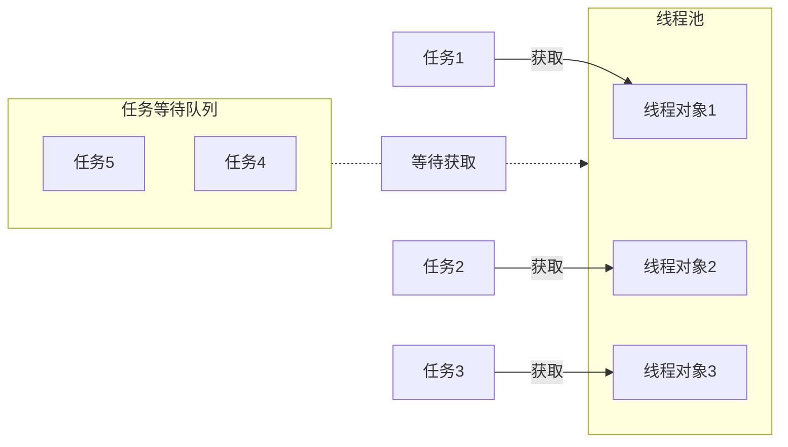

# ❤️ 创建线程
## 💛 Runnable、Callable
- Runnable 没有结果
```java
Runnable job = () -> System.out.println("干完了，但我不告诉你干了啥");
new Thread(job).start();
```
- Callable 有结果
```java
Callable<String> job = () -> {
    return "我干完了，给你结果：活干得不错 ✅";
};
FutureTask<String> ft = new FutureTask<>(job);
new Thread(ft).start();
System.out.println(ft.get()); // 可以获取结果
```

## 💛 线程池
> [!quote] 线程池
> 线程池 是一种利用池化技术思想来实现的线程管理技术，是将提前创建好的线程对象放入到一个池子，任务来了可以直接获取
> 
> - 解耦了线程的创建和任务的执行
> - 不用频繁地创建和销毁进程
> - 便于统一管理线程对象
> - 可以控制最大的并发数



# ❤️ 异步调用
## 💛 Future
> [!quote] Future
> Future 是异步执行过程和结果的载体，是一个泛型接口。
> - 我们可以将某个任务交给 Future 来异步处理，这样我们就能去处理其他事情，不用等待耗时任务执行完成，等我们干完事之后，再通过 Future 获取到耗时任务的执行结果
> - Future 是异步思想的典型运用

- `boolean cancel(boolean mayInterruptIfRunning)` 取消任务执行（成功取消返回 true）
	- 入参为 true - 即使任务正在运行，也尝试中断它
	- 入参为 false - 只取消尚未启动的任务，而不干扰已在运行的任务
- `boolean isCancelled()` 如果任务在完成一直被取消，则返回 true
- `boolean isDone()` 如果此任务已完成（~~正常完成、异常、被取消~~），则返回 true
- 【获取结果】
	- `get()` **阻塞当前线程，直到异步任务完成**，拿到结果，必须手动处理异常
	- `get(long timeout, TimeUnit unit)` 在指定时间内没有返回计算结果就抛出异常

### 💙 CompletableFuture
> [!quote] CompletableFuture
> CompletableFuture 在 Java 8 引入，是对 Future 的增强 ：
> - 异步任务编排组合
> - 函数式编程

<u>创建 CompletableFuture 执行异步任务</u> ：
- `new CompletableFuture<>()` 这种方式创建出的 CompletableFuture 需要手动设置完成状态与结果
- `CompletableFuture.completedFuture(异步结果)` 直接生成异步对象，多用于测试
- `CompletableFuture.runAsync(Runnable接口)` 将执行一个没有返回值的异步任务
- `CompletableFuture.supplyAsync(Supplier接口)` 执行一个异步任务并返回一个结果
- `complete(异步结果)` 直接设置这个异步任务的结果，~~但是不影响 supplyAsync 异步任务的执行，只是会忽略 supplyAsync 最后的执行结果~~

<u>处理任务结果</u> ：
- `join()` 等待异步任务的完成，并获取结果，**如果任务未完成会阻塞当前线程**，不必手动处理异常
- `thenApply(Function接口)` 调用 Function 接口，返回一个新的 CompletableFuture
- `thenAccept(Consumer接口)` 调用 Consumer 接口，消费这个 CompletableFuture
- `thenRun(Runnable接口)` 调用 Runnable 接口，忽略结果，执行指定代码
- `completeAsync(Supplier接口)` 与 supplyAsync 一样，只是 completeAsync 不是静态方法
- `whenComplete(BiConsumer接口)` 无论任务成功还是失败，都进行处理，但是不会改变异步结果（BiConsumer 接口第一个参数是结果，第二个参数是异常）
- `handle(BiFunction接口)` 无论任务成功还是失败，都进行处理，但会转换异步结果并返回新值
- **每个操作方法都有一个对应的 Async 方法** 可以传入指定的线程池对象，来执行对异步结果的处理

```java
CompletableFuture<String> future = CompletableFuture
		.completedFuture("hello")
		.handle((res, ex) -> {
			if (ex != null) return "error";
			return res;
		});
```

<u>处理异常</u> ：
- `CompletableFuture exceptionally(Function接口)` Function 接口的入参是异常，处理后返回新的 CompletableFuture，如果没有异常则不会执行

<u>任务编排</u> ：
- `CompletableFuture thenCompose(Function 接口)` 将上一步的异步操作结果作为下一个异步操作的入参，并生成新的 CompletableFuture
- `CompletableFuture thenCombine(CompletableFuture, BiFunction 接口)` 两个任务（调用者，入参的 CompletableFuture）并行执行，在两个任务都执行完成后，将两个任务的结果合并
- **两个任务，任何一个完成，就执行**
	- `applyToEither(CompletableFuture, Function接口)` 
	- `runAfterEither(CompletableFuture, Runnable接口)`
	- `acceptEither(CompletableFuture, Consumer接口)` 允许你在多个异步任务中，选择其中之一任务执行完成后，立即执行后续的操作，Consumer 的入参是任务结果
- **两个任务，都执行完了，才执行**
	- `thenAcceptBoth(CompletableFuture, BiConsumer接口)` 
	- `runAfterBoth(CompletableFuture, Runnable接口)`
- `allOf(CompletableFuture …)` 会等待入参的所有 CompletableFuture 都执行完成，才会将空 CompletableFuture 的 isDone 状态改为 true
- `anyOf(CompletableFuture …)` 入参的所有 CompletableFuture 又其中之一执行完成，则会返回该任务的 CompletableFuture
- **每个操作方法都有一个对应的 Async 方法**

```java
CompletableFuture<String> future = CompletableFuture
		.completedFuture("hello")
        .thenCombine(
            CompletableFuture.completedFuture("world"),
            (s1, s2) -> s1 + s2
		 )
        .thenCompose(s -> CompletableFuture.supplyAsync(() -> s + "nice!"));
```

```java
CompletableFuture<Void> task3 = task1.acceptEither(task2, (result) -> {
	System.out.println("Task3 execute");
});
```

<u>其他方法</u> ：
- `CompletableFuture<T> copy()` 创建一个当前 CompletableFuture 的副本，这个副本独立于原来的 CompletableFuture
- `orTimeout(long timeout, TimeUnit unit)` 设置该 CompletableFuture 的超时时间，如果在指定时间内未完成，会抛异常
- `completeOnTimeout(T value, long timeout, TimeUnit unit)` 如果在指定的时间内没有完成任务，则会使用 value 作为结果

# ❤️ 原子性
> [!quote] 线程安全
> 线程安全 指的是允许多个执行线程能够安全访问同一内存区域，无需担心并发执行时，各个线程操作相互干扰

## 💛 有锁化
> [!quote] 乐观锁 / CAS
> 
> > 乐观锁 就是<u>假设多个线程在同一数据上的操作通常不冲突</u>【~~所以叫乐观~~】，所以不对数据加锁，而是在提交更新时，会检查数据在读取后是否被其他线程修改过，如果当前线程在修改数据后发现该数据被其他线程修改过，则当前进程所做的操作无效【~~数据是 a，线程 A 将数据修改为 b，在提交时发现数据被修改为 c，那此时回滚线程 A 的操作，所以最后数据会是 c~~】，<u>可能某些系统会重新执行修改操作</u>
> 
> - 乐观锁通常使用版本号或者时间戳来检测数据是否在读取和更新之间发生了变化
> - **所以乐观锁适合在冲突不频繁的系统环境中**

> [!quote] 悲观锁
> 悲观锁 就是假设多个线程在同一数据上会发生冲突，所以对数据进行加锁，直到锁释放，才允许其他线程 <u>读取 / 修改</u>
> 
> - **悲观锁更适合冲突较频繁，或数据一致性要求高的系统环境中**

在高并发的情况下，不适合单独使用任何一种锁，因为有很多事务可能在同一时间点上尝试获取同一个资源的锁，所以使用悲观锁可能导致性能问题，而乐观锁会频繁地回滚

### 💙 synchronized
synchronized 用于确保同一时刻只有一个线程可以执行某个方法或代码块，来实现线程的互斥访问
- synchronized 里的类决定了锁的粒度，比如设置为单例对象，那将锁住所有线程

```java
// 表示锁了SaManager这个类，无论多少个实例同一时间都只能有一个线程访问SaManager
synchronized (SaManager.class) {
	if (saTokenDao == null) {
		setSaTokenDaoMethod(new SaTokenDaoDefaultImpl());
	}
}
```

---

<u>双重检索</u> ：这种判断非常常见
```java
public static SaTokenDao getSaTokenDao() {
	if (saTokenDao == null) {
		synchronized (SaManager.class) {
			if (saTokenDao == null) {
				setSaTokenDaoMethod(new SaTokenDaoDefaultImpl());
			}
		}
	}
	return saTokenDao;
}
```

### 💙 ReentrantLock
`synchronized` 是一种语法糖，`ReentrantLock` 提供了更多的控制，尤其是中断处理、公平锁和条件变量等特性，用于需要更精细控制锁的使用场景下

### 💙 CountDownLatch
CountDownLatch 会维护一个计数器，当计数器中的值为 0 时，才会释放锁

```java
CountDownLatch countDownLatch = new CountDownLatch(1);

// 锁住当前线程
countDownLatch.await();  

// 在另一个线程中解锁
countDownLatch.countDown();
```

## 💛 无锁化
### 💙 Atomic 原子操作
非原子操作是一系列步骤的组合，所以在多线程环境下会出现数据不一致问题

> [!quote] Atomic 原子操作的原理 CAS
> CAS 操作会检查一个变量的当前值是否与预期值相等，如果相等，则将该变量更新为新的值；如果不相等，说明有其他线程已经修改了该变量，CAS 操作失败
> 
> - 无法发现值的变化，比如值从 A 到 B，再到 A，CAS 无法发现
> - 高竞争环境下，CAS 的频繁重试会有开销

> [!quote] 内存模型
> - **Acquire 获取模式** ：强制刷新当前线程的缓存，去共享变量中读取最新值。确保当前线程可以获取到其他线程最新的操作结果
> - **Release 释放模式** ：强制写入最新值到共享变量中。确保当前线程的最新操作可以被其他线程拿到

- `AtomicInteger` / `AtomicLong`  / `AtomicBoolean` 
	- 【改】
		- 原子递增
			- `incrementAndGet` 先递增，再获取
			- `getAndIncrement` 先获取，再递增
		- 原子递减
			- `decrementAndGet` 
			- `getAndDecrement` 
		- 自定义值
			- `set(新值)` 
			- `addAndGet(数值)` 先加法，再 get 新值
			- `getAndSet(新值)` 先 get 旧值，再 set 新值
		- 比较
			- `compareAndExchange(expected, new)` 如果当前值等于 expectedValue，将其更新为 newValue，返回旧值；否则不进行任何操作
			- `boolean compareAndSet(expected, new)` 如果当前值等于 expectedValue，将其更新为 newValue，返回是否成功；否则不操作
			- `compareAndExchangeAcquire` 在执行 compareAndExchange 操作之前，会执行一次 Acquire 操作
			- `compareAndExchangeRelease` 在执行 compareAndExchange 操作之前，会执行一次 Release 操作
	- 【查】
		- `get()` 获取当前值
- `AtomicReference` 
	- `get()` 
	- `set(V newValue)` set 新值，保证可见性
	- `lazySet(V newValue)` 最终设置引用值，可能会有些许延迟
	- `compareAndSet(V expectedValue, V newValue)` 
	- `getAndSet(V newValue)` 
	- `updateAndGet(UnaryOperator<V> updateFunction)` 使用 lambda 原子更新值，并返回更新后的值
	- `accumulateAndGet(V x, BinaryOperator<V> accumulatorFunction)` 原子地将当前值与提供的值进行计算，并将结果更新为新的值

```java
Integer updatedValue = new AtomicReference<>(10).updateAndGet(current -> current + 1);

// 11
```

```java
AtomicReference<StringBuilder> atomicRef = new AtomicReference<>(new StringBuilder("Hello"));

StringBuilder result = atomicRef.accumulateAndGet(" World!", (current, newStr) -> {
	current.append(newStr);
	return current;
});

// Hello World!
```

---

- `AtomicStampedReference` 带有版本戳的 AtomicReference，可以确保在更新引用时检查是否有其他线程修改过该引用
	- `getStamp()` 获取当前的版本戳
- `AtomicMarkableReference` 带有一个布尔标记的 AtomicReference，可以用于标记某种状态
	- `getMark()` 获取当前的布尔标记

# ❤️ 可见性
> [!quote] 可见性
> 可见性 指当多个线程访问同一个变量时，一个线程修改了这个变量的值，其他线程能够立即看得到修改的值【~~在多线程环境下，默认一个线程对共享变量的操作对其他线程是不可见的~~】

<u>如何保证可见性</u> ：
- `volatile` 当一个线程修改共享变量后他会立即被更新到主内存中，其他线程读取共享变量时，会直接从主内存中读取
- `synchronized，Lock` 保证同一时刻只有一个线程获取锁，然后执行同步代码，并且在释放锁之前会将对变量的修改刷新到主存当中

## 💛 volatile
https://cloud.tencent.com/developer/article/1618122
https://blog.csdn.net/goodjava2007/article/details/130978659
https://www.cnblogs.com/dolphin0520/p/3920373.html
https://blog.csdn.net/asd136912/article/details/106243585

> [!quote] `volatile`
> volatile 是一个关键字，给变量加上 `volatile`，以便这个变量在多个线程之间共享，A 线程修改了该变量，B 线程立马能看见
> 
> <u>优点</u> ：
> - 开销低
> 
> <u>缺点</u> ：
> - 非线程安全，volatile 只保证可见性，不保证原子性

---

<u>volatile 如何确保可见性</u> ：在多线程环境中，线程会将变量复制一份到本地线程栈（工作内存）中。如果线程 A 更新了变量的值，线程 B 是看不到这个更新的，因为它仍然在用旧的副本
- 使用 volatile 修饰的变量，线程不会缓存它的副本，每次读写都会直接从主内存（共享内存）中读取最新值
- 当一个线程修改了 volatile 变量的值，JVM 会立即将该变量刷新回主内存，其他线程读取时就能看到最新的值

# ❤️ 有序性
## 💛 volatile
> [!quote] 指令重排序
> 指令重排序 是指编译器或处理器可能会调整代码中指令的执行顺序，以优化性能，**前提是这种调整不会改变程序的单线程语义，但有可能在多线程环境中不符合预期**

<u>volatile 如何确保有序性</u> ：通过插入内存屏障来防止指令重排序 ：
- 写操作：
    - 在 `volatile` 写操作之前，插入 StoreStore 屏障，确保之前的其他写操作不会被重排序到该操作之后
    - 在 `volatile` 写操作之后，插入 StoreLoad 屏障，防止写之后的读操作被重排序到该操作之前，从而保证写之前的数据对其他线程可见
- 读操作：
    - 在 `volatile` 读操作之前，插入 LoadLoad 和 LoadStore 屏障，防止后续的读写操作被重排序到 volatile 读操作之前，确保这些操作基于最新可见的值

---

- 不使用 volatile ：写操作 2 可能优先于写操作 1 执行，导致线程 B 可能看到 a 依然是 0
```java
int a = 0;
boolean flag = false;

// 线程 A
a = 1;      // 写操作 1
flag = true; // 写操作 2

// 线程 B
if (flag) { // 读操作 1
    int value = a; // 读操作 2
}
```
- 使用 volatile ：
	- 由于 flag 是 volatile，在执行写操作 2 时，会确保之前的写操作都完成（也就是写操作 1）；也会确保写操作 2 之后的读操作不会提前（此处没有），
	- 由于 flag 是 volatile，在执行读操作 1 时，会确保之后的所有读操作不会提前（也就是读操作 2 一定在读操作 1 之后）；也会确保读操作 1 之后的所有写操作不会提前（此处没有）
```java
volatile boolean flag = false;
int a = 0;

// 线程 A
a = 1;      // 写操作 1
flag = true; // 写操作 2

// 线程 B
if (flag) { // 读操作 1
    int value = a; // 读操作 2
}
```

## 💛 线程内
<u>在本线程内观察，所有操作都是有序的</u> ：
- 在单个线程内部，操作的执行顺序是按照代码中定义的顺序进行的，不会乱序

## 💛 线程间
<u>在一个线程中观察另一个线程，所有操作都是无序的</u> ~~即从一个线程观察另一个线程的操作时，可能会看到与代码中定义的顺序不一致的行为~~：
- **指令重排序** ：指令重排序不会影响单个线程内操作的最终结果，但是可能会导致不同线程之间观察到的操作顺序与代码中定义的顺序不同
- **工作内存与主内存同步延迟** ：当线程需要读取或写入变量时，它首先与主内存进行同步。由于同步操作可能存在延迟，因此一个线程可能看不到另一个线程对共享变量所做的最新更改

#问题/没搞懂为什么会延迟，这个过程是什么  

> [!quote] 工作内存，主内存
> - 工作内存：每个线程都有自己的工作内存，~~也称为本地内存，或线程栈~~，用于存储该线程使用的变量的副本
> - 主内存：所有线程共享的内存


