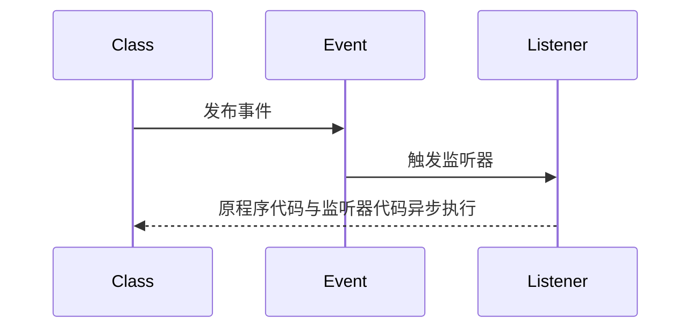

# ❤️ Quick Start
- 事件
```java
@Data
public class GenericEvent extends ApplicationEvent {
    private Long userId;

    public GenericEvent(Object source, Long userId) {
        super(source);
        this.userId = userId;
    }
}
```
- 监听器
```java
@Component 
public class EventListenerService {
	@EventListener
	public void handleGenericEvent(GenericEvent event) {
		// 对这个事件的处理逻辑 ……
	}
}
```
- 事件中心
```java
@Autowired
private ApplicationEventPublisher publisher;

public void publishUserRegisteredEvent(String userId) {
    publisher.publishEvent(new GenericEvent(this, userId));
}
```

# ❤️ 基本概念

> [!quote] 事件驱动编程
> 
> > 事件驱动编程 是将程序的功能变为触发某个事件【~~比如我要实现用户注册成功之后给用户发送邮件，那就改成用户注册成功之后触发事件，由监听器来发送邮件~~】
> 
> - **解耦**：把应用程序拆分成更小，更独立的部分，<u>这些部分通过事件进行通信，而不是直接调用彼此的方法</u>
> - **异步**：当触发事件后，程序继续执行相关代码，程序与监听器异步执行
> - **灵活**：更容易的<u>增删事件</u>【也就是功能】，而不改动原有的程序代码



Spring Event 中事件的执行默认是同步的，~~也就是事件的发布者在监听器执行的过程中是阻塞的~~，如果需要异步，可以使用 `@Async`

> [!hint] 在 SpringBoot 启动完成并且所有的 Bean 都已经创建完毕后，SpringBoot 会发布一个 `ApplicationReadyEvent` 事件

# 设计
## 完全解耦
如果 A 发布事件，B 声明监听器，那这个监听器就要指定监听的事件类，这个事件类是定义在 A 中的。**那就没有达到解耦的效果**，我们可以使用通用事件类，并指定事件类型属性

```java
// 通用事件类
public class EventMessage {
    private String eventType;
    private Object payload;
    ……
}

// 发布事件
public class A {
    private ApplicationEventPublisher publisher;

    public void publishEvent() {
        EventMessage message = new EventMessage("A_EVENT", payload);
        publisher.publishEvent(message);
    }
}

// 监听器
public class BListener {
    @EventListener(EventMessage.class)
    public void handleEvent(EventMessage message) {
        // 判断类型再处理
        if ("A_EVENT".equals(message.getEventType())) {
            // 处理 A 事件
        }
    }
}
```


