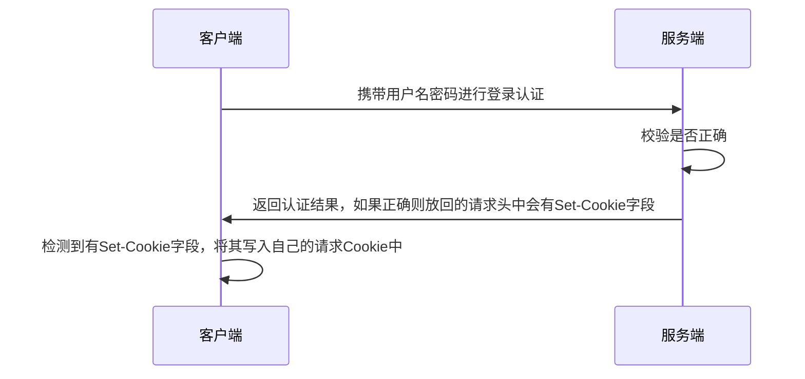

```xml
<dependency>
    <groupId>cn.dev33</groupId>
    <artifactId>sa-token-spring-boot3-starter</artifactId>
    <version>1.42.0</version>
</dependency>
```

# ❤️ 登录认证 · 鉴权流程


# ❤️ 配置文件
```yml   
sa-token: 
    token-name: satoken  # token 名称（同时也是 cookie 名称）
    timeout: 2592000  # token 有效期（单位：秒） 默认30天，-1 代表永久有效
    active-timeout: -1  # token 最低活跃频率（单位：秒），如果 token 超过此时间没有访问系统就会被冻结，默认-1 代表不限制，永不冻结
    is-concurrent: true  # 是否允许同一账号多地同时登录 （为 true 时允许一起登录, 为 false 时新登录挤掉旧登录）
    is-share: true  # 在多人登录同一账号时，是否共用一个 token （为 true 时所有登录共用一个 token, 为 false 时每次登录新建一个 token）
    token-style: uuid  # token 风格（默认可取值：uuid、simple-uuid、random-32、random-64、random-128、tik）
    is-log: true  # 是否输出操作日志 
```

# ❤️ 登录认证
- 【登录】
	- `StpUtil.login(用户id)` 登录该用户，**具体判断这个用户正不正确，要自己判断**
	- `StpUtil.login(用户id, 过期时间)` 单位是毫秒
- `StpUtil.logout()` 注销当前用户
- `StpUtil.logout(账号id)` 
- `StpUtil.logout(账号id，端)` 注销 pc 端，还是 ……
- `StpUtil.logoutByTokenValue(token)` 指定 token 注销
- 【查】
	- `boolean StpUtil.isLogin()` 登录状态
	- `StpUtil.getLoginId()` 获取当前会话账号 id，获取不到会抛出异常，但是获取到了会自动更新 active-timeout
	- `StpUtil.getLoginIdDefaultNull()` 获取当前会话账号 id，未登录返回 null
	- `StpUtil.getLoginIdByToken(String tokenValue)` 获取指定 token 的账号 id，未登录返回 null

# ❤️ token

> [!quote] token 的状态
> - 过期 ---> timeout 到了
> - 无效 ---> 手动注销，踢人下线
> - 冻结 ---> active-timeout 到了

> [!warning] ! ! !
> 1. 跨域的情况下，不建议前端往 header 中塞自定义的 token，因为会触发 OPTIONS 预检请求，这个请求是不会携带 token 信息的，此时后端接受到后会报 token 错误，预检请求报错，则实际请求就会报跨域错误
> 2. 推荐后端的登录接口直接往响应结果的响应头中放 Set-Cookie，这样浏览器会自动给所有请求加上该 Cookie，后端再进行判断

- `StpUtil.getTokenValue()` 获取当前会话的 token 
- `StpUtil.getTokenInfo()` 查询 token 信息
- `StpUtil.getTokenName()` 获取当前 `StpLogic` 的 token 名称
- `StpUtil.searchTokenValue(搜索的关键词, 分页页码, 分页大小, 是否升序排序)` 查找所有已登录的 token 
	- 关键词不需要可以传空字符串
	- 升序 ：先登录的在前

## 💛 timeout

> [!quote] timeout 有效期
> timeout 代表 token 的长久有效期，~~单位/秒~~，在 timeout 后 token 必定过期，无法继续使用
> 
> - timeout 配置为 `-1` ，代表永久有效，不会过期。使用 `StpUtil.renewTimeout(100)` 续签
> - 到期必须重新登录

- `StpUtil.getTokenTimeout()` 获取当前会话剩余有效期（-1 为永久有效），~~单位秒~~

#问题 timeout 过期之后，token 会被删除吗 ?

## 💛 active-timeout

> [!quote] active-timeout 最低活跃频率
> active-timeout 代表最低活跃频率，~~单位/秒~~，用户在 active-timeout 内无操作，则此 token 立即过期，但不会被删除
> 
> - 用户在 active-timeout 内有操作，则会再次续签
> - active-timeout 配置为 `-1` ，代表永久有效，不会过期
> - **所以调用过** `StpUtil.getLoginId()` **的方法都会续签 active-timeout**，[哪些方法注解会自动续签](https://sa-token.cc/doc.html#/fun/token-timeout?id=stputil-%e7%b1%bb%e4%b8%ad%e5%93%aa%e4%ba%9b%e5%85%ac%e5%bc%80%e6%96%b9%e6%b3%95%e6%94%af%e6%8c%81%e8%87%aa%e5%8a%a8%e7%bb%ad%e7%ad%be-active-timeout)

- `StpUtil.checkActiveTimeout()` 检查当前 token 是否已经被冻结，如果是则抛出异常
- `StpUtil.updateLastActiveToNow()` 续签当前 token，**即使 token 已经被冻结也可续签成功**
- `StpUtil.updateLastActiveToNow(token)` 为指定 token 续签，**即使 token 已经被冻结也可续签成功**

# ❤️ 鉴权
- 维护一个权限，和角色的配置
```java
@Configuration
public class SaTokenPermissionConfig implements StpInterface {

    /**
     * 返回一个账号所拥有的权限码集合
     */
    @Override
    public List<String> getPermissionList(Object loginId, String loginType) {
        return List.of();
    }

    /**
     * 返回一个账号所拥有的角色集合
     * @param loginId 用户id
     * @param loginType 账号体系标识
     */
    @Override
    public List<String> getRoleList(Object loginId, String loginType) {
        Map<String, List<String>> roleMap = MapBuilder.create(new HashMap<String, List<String>>())
                .put("10001", List.of("admin"))
                .put("10002", List.of("user"))
                .put("10003", List.of("guest"))
                .build();

        return roleMap.get(loginId.toString());
    }
}
```

## 💛 代码鉴权 - 不推荐
### 💙 角色
- `StpUtil.getRoleList()` 获取当前账号所拥有的角色集合
- `StpUtil.hasRole(角色名)` 判断当前账号是否拥有指定角色
- `StpUtil.checkRole(角色名)` 
- `StpUtil.checkRoleAnd(角色数组)` 校验当前账号是否含有指定角色标识，全部通过才行
- `StpUtil.checkRoleOr(角色数组)` 校验当前账号是否含有指定角色标识，其一通过即可

### 💙 权限 

## 💛 注解鉴权 - 不推荐
在 Controller 层加入注解判断是否有权限进入

### 💙 认证忽略
- `@SaIgnore` 被其修饰的所有方法和类，都无需认证即可访问，**此注解具有最高优先级**

## 💛 路由拦截鉴权 - 推荐
对所有的接口进行统一管理

```java
@Configuration
public class STPRouteInterceptor implements WebMvcConfigurer {

    @Override
    public void addInterceptors(InterceptorRegistry registry) {
        registry.addInterceptor(new SaInterceptor(handler -> {
                    // 已经被拦截器拦截到了，接下来要怎么处理
                    SaRouter.match("/api/raffle/**", "/api/security/**")
                            .notMatch("/api/security/user/v1/doLogin")
                            .notMatch(SaHttpMethod.OPTIONS)  // 放行预检请求
                            .check(() -> StpUtil.checkRoleOr(EnumSet
                                    .allOf(UserBO.UserRole.class).stream()
                                    .map(Enum::name)
                                    .toArray(String[]::new)
                            ));
                }))
                .addPathPatterns("/api/**");  // 指定拦截器需要拦截的 URL
    }

}
```

#问题 
```java
SaRouter.match("/api/raffle/**", "/api/security/**")
		.notMatch("/api/security/user/v1/doLogin")
		.check(() -> StpUtil.checkRoleOr(EnumSet
				.allOf(UserBO.UserRole.class).stream()
				.map(Enum::name)
				.toArray(String[]::new)
		));
与
SaRouter.match("/api/raffle/**")
		.match("/api/security/**")
		.notMatch("/api/security/user/v1/doLogin")
		.check(() -> StpUtil.checkRoleOr(EnumSet
				.allOf(UserBO.UserRole.class).stream()
				.map(Enum::name)
				.toArray(String[]::new)
		));
是不一样的
```


