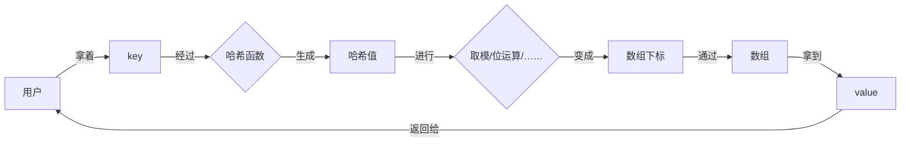

# 散列表（哈希表）

> [!quote] 散列表
> 散列表 本质是一个数组，提供了 key 和 value 的对应关系【~~只要给出 key 就马上可以找到 value，时间复杂度为 `O(1)`~~】
> 

<u>填装因子</u> ：填装因子 = 关键字个数 / 散列表长度

<u>散列表的原理</u> ：散列表本质是一个数组，而哈希函数就是将 **key** 与**数组下标**转换的桥梁


## 哈希冲突
> [!quote] 哈希冲突
> 
> > 哈希冲突 就是两个不同的 key 经由哈希函数转换取模后，出现的数组下标相同的冲突
> >```mermaid
> >graph LR
> >	a[key1]-->c{哈希函数}-->d[哈希值]-->e{取模……}
> >	b[key2]-->c-->d-->e
> >	e-->f[数组下标]
> >```
> 
> 解决办法：
> - **开放寻址法**：冲突后，就从冲突位置往后找空位插入【~~应用于 ThreadLocal~~】
> 
> - **链表法 / 拉链法**：冲突后，把冲突的位置当成是链表的头结点【~~应用于 HashMap 中~~】
> 
> - **再哈希法**：同时构造多个哈希方法，第一个方法重复后，再哈希第二个方法
> - **建立公共溢出区**：建立一个区域供所有冲突的元素放，这个区域又可以叫溢出表，没有发生冲突的放在基本表里

## 写操作

## 读操作
- 通过哈希函数，将 key 转换为数组下标
- 根据数组下标找到对应的元素，看看 key 是否正确匹配【~~意味着哈希表的每个槽位都存储一个 key，一个 value~~】
	- 如果正确，那就找到了
	- 如果不正确，那就顺着该位置的链表，往下继续匹配

## 扩容

> [!NOTE] 什么时候需要扩容 ?
> 当 `HashMap.size` >= `Capacity` * `LoadFactor` 
> - `HashMap.size` ：总长度
> - `Capacity` ：当前长度
> - `LoadFactor` ：负载因子，默认是 0.75

- 创建一个新的 Entry 空数组，长度是原来的 2 倍
- 由于数组长度不同，所以哈希规则也不同，遍历原 Entry 数组，重新 Hash 到新数组


