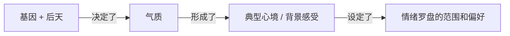

# 🪞 认识自己（认识情绪）
🔴 **情绪 & 气质的关系** —— 情绪由刺激源 + 对过往经验的解读和认知 + 当下状态 + 气质组成，由感性系统自动产生

🔴 **情绪 & 情感的关系** —— 情感是情绪的延续和弥漫，比如一整天都感到低落或烦躁

## 📖 情绪罗盘与气质
**气质不决定情绪，而是决定情绪反应的范围和倾向，它由先天气质决定，并受童年环境持续塑造**

🔴 **气质的四种类型**
- 胆怯型 —— 反应水平较高（静止血压偏高、瞳孔扩张较大、去甲肾上腺素水平高），大约 1/5 的婴儿属于此类
- 大胆型 —— 大约 2/5 的婴儿属于此类
- 乐观型 —— 喜欢社交、乐观向上、总是感到愉快、有强烈的自信，能享受人生乐趣。左半脑活跃度较高
- 忧郁型 —— 对微不足道的事情大惊小怪，容易退缩和感伤，把世界看成充满可怕困难和危险的地方。右半脑活跃度较高

> 在一个实验中，乐观的"左脑人"看喜剧片时非常开心，对血淋淋的外科手术画面只有最微弱的反应；郁闷的"右脑人"认为喜剧片并不好笑，却对手术画面感到非常害怕和恶心

> 可以根据妈妈离开房间后婴儿会不会哭来预测前额叶活跃度 —— 会哭的婴儿右半脑活跃度较高，不哭的左半脑活跃度较高

## 📖 情绪分类
**关于情绪的分类目前还没有明确的答案，许多情绪不知道如何归类**。例如希望、信仰、勇气、宽恕、镇静、怀疑、自满、懒惰、麻木、厌倦、嫉妒（嫉妒是一种复杂情绪，由愤怒演变而来，还掺杂了悲伤和恐惧）

| 情绪家族 | 家庭成员                                              | 极端/病态表现  |
| ---- | ------------------------------------------------- | -------- |
| 愤怒   | 狂怒、暴怒、怨恨、激怒、恼怒、义愤、气愤、刻薄、生气、易怒、敌意                  | 病态的仇恨和暴力 |
| 悲伤   | 忧伤、歉疚、沉闷、阴郁、忧愁、自怜、寂寞、沮丧、绝望                        | 严重抑郁     |
| 恐惧   | 焦虑、忧虑、焦躁、担忧、惊恐、疑虑、警惕、疑惧、急躁、畏惧、惊骇、恐怖               | 恐惧症和恐慌   |
| 喜悦   | 幸福、欢乐、欣慰、满意、极乐、快乐、可笑、自豪、感官愉悦、兴奋、欣喜、享受、满足、欣快、癫狂、狂喜 | 躁狂症      |
| 喜爱   | 认同、友爱、信任、仁慈、亲和、热切、倾慕、迷恋、圣爱                        | —        |
| 惊讶   | 震惊、惊奇、奇妙、惊叹                                       | —        |
| 厌恶   | 轻蔑、鄙视、蔑视、憎恶、嫌恶、讨厌、反感                              | —        |
| 羞耻   | 内疚、尴尬、懊恼、悔恨、羞辱、后悔、屈辱、悔改                           | —        |

## 📖 情绪的生理机制
**每一种情绪都有对应的生理反应，远古时期是生存本能，现代社会则需要被理性驾驭，否则将引发灾难性后果**

| 情绪  | 生理反应                       | 远古生存意义                 |
| --- | -------------------------- | ---------------------- |
| 愤怒  | 血液流向手部，心率加快，肾上腺素激增         | 方便抓取武器或攻击敌人            |
| 恐惧  | 血液流向大块骨骼肌（如双腿），面部发白，身体瞬间呆住 | 方便逃跑，感觉变敏锐             |
| 快乐  | 抑制负面感觉的大脑中枢活跃，忧虑中枢趋于平静     | 身体得到休息，为下一任务储备热情       |
| 爱   | 唤起副交感神经                    | 产生温柔感，身体平静满足，易于合作      |
| 吃惊  | 眉毛上挑，视野扩大，更多光线射向视网膜        | 捕捉更多意外事件信息             |
| 厌恶  | 上唇撇向一边，鼻头微皱                | 避免吸入有害气体或吐出有毒食物        |
| 悲伤  | 生命活动能量降低，新陈代谢减缓            | 创造哀悼和反思的机会，将脆弱个体留在安全之处 |

## 📖 处理情绪的三种方式
🔴 **自我意识** —— 在情绪发生时有所觉察，能更好地理解感受产生的原因，陷入负面情绪时能够迅速摆脱，对人生比较乐观

> **自我意识**是对内在心理的持续关注，是跳出自己看自己，作为旁观者站在自己旁边观察自己，并且保持中立。例如能够意识到“我生气了”、“生气对我不好”

🔴 **吞没** —— 情绪主宰一切，反复无常，意识不到自身的情绪、迷失其中不自知，经常感到压抑和情绪失控

🔴 **接受** —— 清楚自己的感受但不试图改变
- 一种是经常有好心情，没有动机改变这种状况的人
- 一种是容易心情不好却放任自流的人，不采取任何措施改变困扰情绪，常见于陷于绝望的抑郁症患者