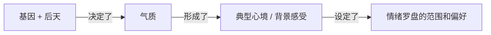

# 📚 多元智能与人生成功
🔴 **人生成功取决于七种多元智能的综合发展**
- 语言
- 数学逻辑
- 空间智能（例如艺术家、建筑师）
- 身体运动智能（例如舞蹈家）
- 音乐智能
- 人际智能 —— 能准确识别及回应他人情绪、气质、动机、欲望的能力，例如销售人员、政治家、教师、临床医生、宗教领袖、治疗师
- 内省智能 —— 塑造准确、真实的自我模式，并应用这种模式有效应对生活的能力，包括正视及辨识自身感受，并以此引导行为

🔴 **人际智能包含四种核心能力**
- 组织团队 —— 领导者的基本技能，发动并协调团队努力开展工作
- 协商解决办法 —— 调停的才能，防止冲突或解决突发危机
- 人际联系 —— 同理心，处理人际关系的艺术
- 社会分析 —— 能够体察和领悟他人的感受、动机

# 📚 两套思维系统
人类大脑同时运行着理性和感性两套思维系统，它们各有分工、协调运作，任何一方独大都会出问题 —— 强烈的感觉会破坏理性判断，但完全没有感觉也会让人无法做出正确选择

## 📖 理智小人与感觉小人
我们的大脑里住着两个小人 —— 理智小人负责逻辑推理，感觉小人负责情绪感受，二者需要协调运作而非相互压制（强烈的感觉会破坏理性判断，但完全没有感觉也会让人无法做出正确选择）

🔴 **理智小人**（理性思维） —— 像会计师一样，凡事讲究逻辑、事实、数据和因果关系

> "因为我没复习（原因），所以我考试不及格（结果）"

🔴 **感觉小人**（情绪心理） —— 像艺术家或诗人一样，不怎么讲道理，更看重感觉、联想和画面，思维是跳跃性的

> 在决定和谁结婚、应该信任谁、从事什么工作时，仅仅依靠逻辑是行不通的，还需要感性的辅助

## 📖 感觉小人的工作方式
**感觉小人不像理智小人那样一步步推理，而是通过联想来产生情绪 —— 看到一个东西，联想到另一个东西，情绪就跟着来了**

> 你看到一片落叶（A），并不会去分析它的化学成分，感觉小人会马上联想到秋天（B），然后联想到时光流逝（C），最后让你感到一丝伤感（D）

🔴 **联想的两种触发方式**
1. 象征 —— 看到的东西本身不重要，重要的是它代表了什么
2. 触发记忆 —— 现在发生的事，勾起了过去一段含有同样情绪的记忆

> 象征案例 ：国旗本身只是一块布，但它象征着国家、荣誉和归属感。所以看到国旗升起，你会感到自豪和激动
> 
> 触发记忆案例 ：你闻到一股熟悉的饭菜香味，突然感到很温暖、很安心，因为这个味道触发了小时候在奶奶家吃饭的幸福记忆

🔴 **为什么比喻、故事、艺术、宗教仪式能打动人心** —— 它们都在用"感觉小人"最擅长接收的语言（联想、象征、画面）直接与心灵对话

> 理性说法："他的话让我很难受"（很平淡）  
> 比喻说法："他的话像一把刀子插在我心上"（感觉马上就来了）
> 
> 分析 ：理智小人知道话不可能是刀子，但感觉小人立刻联想到"刀子 = 尖锐、伤害、疼痛"，于是你瞬间就感受到了那种痛苦

> 佛陀和基督用寓言而非哲学理论来教导，因为故事和比喻是直通心灵的捷径，人们的“感觉小人”就能立刻理解并记住其中的道理。
> 
> 宗教符号和仪式（十字架、佛珠、祷告）从理智小人看没什么实际作用，但对感觉小人来说，它们是极其强大的象征（看到十字架，信徒就联想到牺牲、救赎、爱；一拿起佛珠，内心就会联想到平静和修行）

> 一部悲伤的电影不会只用字幕告诉你"主角很伤心"，它会用下雨的场景、缓慢悲伤的背景音乐、主角孤独的背影，让你通过联想直接体验到那种悲伤

## 📖 情绪反应的两条通道
**感觉小人有两条工作通道 —— 一条极快（本能反应），一条较慢（想法引发）**

🔴 **快通道：情绪心理通道** —— 源于心灵，几乎瞬间发生，反应速度远快于理性思维，排除了精确缜密的思考

> 看到出租车司机绕路时，愤怒瞬间涌上心头；看到可爱的宝宝时，喜爱之情自然流露

🔴 **慢通道：理性心理通道** —— 源于大脑，更加精密，在触发感受之前会先在思维中酝酿

> 更复杂的情绪，比如尴尬、对即将来临的考试感到焦虑，通常需要几秒或几分钟才会表露出来，这些是由想法产生的情绪

🔴 **情绪的可操控性** —— 我们可以通过有意识地思考影响、操控情绪，但无法决定直接产生什么情绪。也就是说我们能控制的是情绪反应的过程，而非情绪的产生

> 通过快乐的记忆使自己高兴、通过悲观的想法让自己陷入沉思、通过性幻想激发性感受

> 演员有意识利用理性心理通道，用思考激发情感的本领比普通人高超得多

## 📖 感觉小人占上风
**当情绪占上风时，我们的思维会退化成小孩子** —— 看问题极端化（不是天使就是恶魔），以自我为中心（都是别人的错），固执己见（只相信自己想相信的）。这时候讲道理是没用的，因为情绪系统会自动过滤掉所有不符合当前感受的信息，并生成一套"自我辩护"的逻辑来证明自己是对的

🔴 **退化表现一：非黑即白** —— 小孩子的世界很简单，好人和坏人、对和错、喜欢和讨厌，没有灰色地带

🔴 **退化表现二：以自我为中心** —— 以自己的视角为唯一视角，把责任外推，不愿承认自己的错。因为承认错误 = 承认"我不够好" = 威胁自我价值感 = 情绪痛苦，所以情绪心理会自动启动自我保护机制

🔴 **退化表现三：确认偏误** —— 只看见自己想看见的，只相信支持自己观点的证据，忽视或否认反对自己观点的证据

# 📚 认识情商
**情商是管理情绪的能力，帮助我们在压力、突发事件中保持身心健康**

## 📖 情商 & 智商
🔴 **同人打交道靠情商，同事打交道靠智商** —— 这就是为什么职位越高，情商的重要性越突出；在基层岗位，智商和专业技术的指标性更明显

|      | 情商高  | 情商不高 |
| ---- | ---- | ---- |
| 智商高  | 春风得意 | 怀才不遇 |
| 智商不高 | 贵人相助 | 一事无成 |

🔴 **高智商偏向内在思维世界，高情商偏向外在社交世界**

| 类型    | ✅ 优势                                                               | ❌ 劣势                                                        |
| ----- | ------------------------------------------------------------------ | ----------------------------------------------------------- |
| 高智商男性 | 智力活动兴趣广泛、野心勃勃、工作高效、沉稳冷静、顽强不屈、对外界的议论毫不在意                            | 刻板乏味、拘束、不善表达、在人际关系和情感交流中有距离感、喜欢批评、自视甚高、过分讲究和拘束、对性和感官体验感到不自在 |
| 高情商男性 | 热爱社交、外向乐观、不易受恐惧和焦虑困扰、具有很强的责任感和道德感、富有同情心、情绪生活丰富而恰如其分、对自身、他人、社会感到很自在 |                                                             |
| 高智商女性 | 对智力充满自信、能流畅表达思想、注重智力和审美                                            | 内向、容易焦虑、凡事想得过多、容易产生内疚感、不愿公开表达愤怒（可能会间接表达）                    |
| 高情商女性 | 过于自信、喜欢直接并可以恰当地表达情感、积极面对人生、外向热爱交际、善于处理压力、很少焦虑内疚、对自身和感官体验态度轻松自然     |                                                             |

## 📖 情商的五大核心能力
- 了解自身情绪（认识自己） —— 感受发生时能够识别它。如果无法注意到自身的真实感受，我们就只能听命于感受的操控，而对自身情绪更确定的人，对生活有更强的掌控力
- 管理情绪（管理自我） —— 恰当处理情绪，从挫折和烦恼中快速恢复，而非被痛苦情绪长期困扰
- 自我激励（激励自己） —— 延迟满足、抑制冲动，进入涌流状态
- 识别他人情绪（认识别人） —— 捕捉微妙的社会信号，用同理心感知他人的需要和欲望
- 处理人际关系（管理别人） —— 提高受欢迎程度、领导力、人际交往的有效性，在任何需要协作的领域脱颖而出

# 🪞 认识自己
## 📖 情绪罗盘与气质
**我们的情绪基准线和波动范围，在很大程度上由先天气质决定，并受童年环境持续塑造**



🔴 **气质的四种类型**
- 胆怯型 —— 反应水平较高（静止血压偏高、瞳孔扩张较大、去甲肾上腺素水平高），大约 1/5 的婴儿属于此类
- 大胆型 —— 大约 2/5 的婴儿属于此类
- 乐观型 —— 喜欢社交、乐观向上、总是感到愉快、有强烈的自信，能享受人生乐趣。左半脑活跃度较高
- 忧郁型 —— 对微不足道的事情大惊小怪，容易退缩和感伤，把世界看成充满可怕困难和危险的地方。右半脑活跃度较高

> 在一个实验中，乐观的"左脑人"看喜剧片时非常开心，对血淋淋的外科手术画面只有最微弱的反应；郁闷的"右脑人"认为喜剧片并不好笑，却对手术画面感到非常害怕和恶心

> 可以根据妈妈离开房间后婴儿会不会哭来预测前额叶活跃度 —— 会哭的婴儿右半脑活跃度较高，不哭的左半脑活跃度较高

## 📖 情绪分类
**关于情绪的分类目前还没有明确的答案，许多情绪不知道如何归类**。例如希望、信仰、勇气、宽恕、镇静、怀疑、自满、懒惰、麻木、厌倦、嫉妒（嫉妒是一种复杂情绪，由愤怒演变而来，还掺杂了悲伤和恐惧）

| 情绪家族 | 家庭成员                                              | 极端/病态表现  |
| ---- | ------------------------------------------------- | -------- |
| 愤怒   | 狂怒、暴怒、怨恨、激怒、恼怒、义愤、气愤、刻薄、生气、易怒、敌意                  | 病态的仇恨和暴力 |
| 悲伤   | 忧伤、歉疚、沉闷、阴郁、忧愁、自怜、寂寞、沮丧、绝望                        | 严重抑郁     |
| 恐惧   | 焦虑、忧虑、焦躁、担忧、惊恐、疑虑、警惕、疑惧、急躁、畏惧、惊骇、恐怖               | 恐惧症和恐慌   |
| 喜悦   | 幸福、欢乐、欣慰、满意、极乐、快乐、可笑、自豪、感官愉悦、兴奋、欣喜、享受、满足、欣快、癫狂、狂喜 | 躁狂症      |
| 喜爱   | 认同、友爱、信任、仁慈、亲和、热切、倾慕、迷恋、圣爱                        | —        |
| 惊讶   | 震惊、惊奇、奇妙、惊叹                                       | —        |
| 厌恶   | 轻蔑、鄙视、蔑视、憎恶、嫌恶、讨厌、反感                              | —        |
| 羞耻   | 内疚、尴尬、懊恼、悔恨、羞辱、后悔、屈辱、悔改                           | —        |

## 📖 情绪的生理机制
**每一种情绪都有对应的生理反应，远古时期是生存本能，现代社会则需要被理性驾驭，否则将引发灾难性后果**

| 情绪  | 生理反应                       | 远古生存意义                 |
| --- | -------------------------- | ---------------------- |
| 愤怒  | 血液流向手部，心率加快，肾上腺素激增         | 方便抓取武器或攻击敌人            |
| 恐惧  | 血液流向大块骨骼肌（如双腿），面部发白，身体瞬间呆住 | 方便逃跑，感觉变敏锐             |
| 快乐  | 抑制负面感觉的大脑中枢活跃，忧虑中枢趋于平静     | 身体得到休息，为下一任务储备热情       |
| 爱   | 唤起副交感神经                    | 产生温柔感，身体平静满足，易于合作      |
| 吃惊  | 眉毛上挑，视野扩大，更多光线射向视网膜        | 捕捉更多意外事件信息             |
| 厌恶  | 上唇撇向一边，鼻头微皱                | 避免吸入有害气体或吐出有毒食物        |
| 悲伤  | 生命活动能量降低，新陈代谢减缓            | 创造哀悼和反思的机会，将脆弱个体留在安全之处 |

## 📖 处理情绪的三种方式
🔴 **自我意识** —— 在情绪发生时有所觉察，能更好地理解感受产生的原因，陷入负面情绪时能够迅速摆脱，对人生比较乐观

> **自我意识**是对内在心理的持续关注，是跳出自己看自己，作为旁观者站在自己旁边观察自己，并且保持中立。例如能够意识到“我生气了”、“生气对我不好”

🔴 **吞没** —— 情绪主宰一切，反复无常，意识不到自身的情绪、迷失其中不自知，经常感到压抑和情绪失控

🔴 **接受** —— 清楚自己的感受但不试图改变
- 一种是经常有好心情，没有动机改变这种状况的人
- 一种是容易心情不好却放任自流的人，不采取任何措施改变困扰情绪，常见于陷于绝望的抑郁症患者

# 🧭 管理自己
**管理情绪的目的是实现平衡，减少负面情绪、增加幸福情绪，而不是压抑或只维持一种情绪**
- 每一种情绪都有其价值和意义，苦难对创造性和精神生活有积极意义，如果随时保持快乐，依旧平淡乏味
- 我们无需避免不快，而是不让失控的情绪扰乱所有愉快的情绪
- 焦虑、愤怒、悲伤等强烈情绪的信号会破坏前额叶保持工作记忆的能力，使我们无法好好思考，损害学习能力
- 压力之下必有愚夫 —— 如果有压力、情绪低落，人们就会变得愚蠢，无法聚精会神、思路清晰地记忆、学习、决策

## 📖 愤怒
**愤怒是最难以控制的情绪，当个体已经处于烦躁状态时，一旦被某种东西触发情绪失控，情绪强度会更大**

🔴 **社会上流行的两种愤怒观都是错的**
- 发泄 ：发泄不会缓解愤怒，会唤起情绪脑，使人感到更加愤怒
- 压抑 ：压制愤怒会使身体更加激动不安，血压升高

🔴 **四种有效途径**
- 认知重构 —— 控制和质疑触发愤怒的想法（越早进行控制越有效，缓和性信息如果在愤怒表达之前出现，就可以完全终止愤怒，它让个体对激发愤怒的事件进行再次评估，对一般水平的愤怒可以发挥很大作用，对高水平的暴怒效果有限）
- 冷却与转移 —— 身处不可能进一步引发愤怒的环境，等待肾上腺涌动逐渐消失，如果仍然对触发愤怒的想法耿耿于怀，冷静期就不会产生作用
	- 低唤起运动 ：散步、积极运动、深呼吸、肌肉放松 ……
	- 转移注意力 ：开车、远离对方、数 10 下
	- 放纵购物、吃东西效果不大
- 萌芽遏制 —— 把敌意想法写下来（在愤怒或敌意想法刚刚萌芽时就把它们遏制住，并且把它们写下来）
- 同理心 —— 学会从他人角度看待问题的能力，尽量往善意的方面想

> 案例一 ：电梯迟迟不来，不要想象这是某个自私的家伙在捣乱，而是尽量往善意的方面想，他可能很着急所以占用了电梯

## 📖 焦虑
🔴 **正确看待忧虑**
- ✅ 适当的忧虑有积极的一面，它是应对潜在威胁的预演
- ❌ 慢性忧虑（失眠症患者）通常只是反复琢磨危险本身，把常人根本注意不到的危险强加到自己的生活中

🔴 **化解法**
- 第一步 ：自我意识 —— 将忧虑扼杀在摇篮里（识别引发忧虑的情景、最初的念头，伴随焦虑出现的身体感觉）
- 第二步：批判质疑 —— 挑战忧虑想法（可怕的事情真的有可能发生吗、可以采取哪些建设性的措施、一直忧心忡忡真的有用吗）
- 第三步：转移注意力

## 📖 悲伤
🔴 **悲伤的特点** —— 悲伤的人会倾向于选择悲伤的活动

🔴 **悲伤的好处** ：悲伤会降低我们对娱乐和休闲的兴趣，使我们把注意力集中于损失，认真思考其中的意义，最后进行生理调节并展开新的计划，让生活继续下去

🔴 **无效做法**
- 独处 —— 会增添悲伤的孤独感和疏离感
- 哭泣 —— 使人越来越陷入沉思，只会延长悲伤
- 饮酒 —— 酒精是中枢神经抑制剂，只会令抑郁更加严重

🔴 **有效的做法**
- 认知重建 —— 用不同的角度看待问题，质疑沉思的核心想法，得出更积极的替代想法
- 愉快的转移注意力活动 —— 有氧运动、激烈的体育赛事、滑稽的电影、鼓舞人心的图书
- 社会交往 —— 外出就餐、打球、看电影 ……（前提是不在社交中继续反刍负面想法）
- 感官愉悦 —— 洗热水澡、吃喜爱的食物、听音乐、做爱、给自己买礼物
- 取得小小的胜利 —— 把堆积已久的家务做完、完成有待解决的任务、提升自我形象
- 帮助他人 —— 投身志愿者工作（抑郁起源于对自身的沉思，如果我们对他人的痛苦感同身受，帮助他人能使我们摆脱对自身的过度关注）
- 祈祷 —— 对宗教虔诚的人尤其有效，适用于缓解所有情绪

> 一段感情关系结束了，自然令人感伤，如果产生"我会永远孤单下去"的想法，肯定会加深绝望。但回过头来想想，这段感情并没有那么美好，你和恋人也有格格不入的地方

## 📖 压抑
**压抑者习惯性地无意识屏蔽负面情绪** —— 他们在面对令人不安的刺激时，表面上非常冷静，声称自己毫无焦虑，但身体却出现了明显的焦虑反应（心跳加快、出汗、血压升高）

🔴 **特质从何而来** ：大约每 6 个人中就有 1 个
- 童年困境中的自保策略（如父母酗酒）
- 父母本身就是压抑者，通过榜样示范或遗传传递

🔴 **优缺点**
- 好处 —— 这确实是一种成功的情绪自我调节策略，让人保持乐观、镇定
- 代价 —— 以牺牲自我意识为代价，对自己的真实情绪状态一无所知

# 🔥 激励自己
## 📖 好心情
**保持好心情能增强灵活思考和处理复杂问题的能力，大笑和情绪高涨能使人思路更加开阔、联想更加自由，更加有创意性**
- 心情好时制定决策会偏向积极方向，作出勇敢、大胆的决策
- 心情不好时制订计划会偏向消极方向，作出过度警惕的决定

## 📖 希望 & 乐观
**希望和乐观让人不屈服于焦虑、更少抑郁、更少情绪困扰，能力不是固定的，信心影响能力的发挥**
- 希望 —— 无论目标是什么，都相信自己有决心而且有能力实现既定目标
- 乐观 —— 平静地接受拒绝是必不可少的能力，你要认为挫折或失败是由客观条件引起的，而我们可以改变这些条件

## 📖 涌流
**涌流是一种忘我的专注状态，此时情绪不受抑制和牵绊，而是积极的、充满活力的，与当前任务协调一致**（令人沉醉的做爱也许最能捕捉到涌流的状态）

🔴 **涌流的特征**
- 注意力高度集中，只关注与当前任务有关的狭窄范围，忘掉时间和空间
- 忘我 —— 与沉思和忧虑正好相反，把健康、金钱、成功通通抛诸脑后
- 对所从事的活动有很强的控制力，对不断变化的任务要求反应自如

🔴 **如何进入涌流**
1. 不能处于抑郁倦怠或者焦躁不安的状态
2. 有意识地集中注意力 —— 一旦注意力锁定目标任务，就会激发出一种内在力量，不仅能减缓情绪波动，还使完成任务变得轻而易举
3. 任务难度略高于当前能力 —— 要求过低会觉得乏味，要求过高会产生焦虑
4. 摒弃功利心 —— 行为本身的绝对愉悦才是动机，而非关心自己的表现，而非想着成功或失败

> 一位作曲家这样形容 ：你达到了一种如此入迷的境界，以致你感到自己几乎是不存在的。我的手好像不属于我，我只是坐在那里充满敬畏和惊叹地看着，音符自己流淌出来了

> 有位外科医生回忆他在实施一个难度很大的手术时的涌流状态。做完手术后他注意到手术室地板上有碎瓦砾，原来手术期间有一块天花板掉了下来，但他完全没有注意到

## 📖 延迟满足 & 抑制冲动
抑制冲动被看作是为了长远利益，而对即时欲望的克制

# 👀 认识别人
**同理心是感知他人情绪的核心能力，它建立在自我意识的基础上，在童年情感互动中萌芽，也可能在忽视与暴力中枯死**

> 人冷静下来为什么会后悔 —— 吵架时情绪占满全身，感受不到对方；冷静下来后，同理心恢复了，终于看到对方的委屈、恐惧、受伤，所以感到后悔

## 📖 同理心的本质
🔴 **同理心的前提是自我意识** —— 你只有对某种情绪有过体验，看到别人呈现同样的信号时才能共鸣。你能感知自己多深，就能感知别人多深

🔴 **缺乏同理心的两类人**
- 述情障碍者 —— 没有同理心，因为不清楚自身的感受，所以对他人的感受更是一无所知
- 反社会分子 —— 无法感受到任何同理心或同情心

🔴 **性别差异** —— 一般而言，女性的同理心强于男性

## 📖 同理倾听的实践
[[🦒 非暴力沟通#👂 同理倾听]]

# 🤝 管理别人
🔴 **三种社交人格**
- 交际花 —— 主动迎合别人，以牺牲个体真实的满足感为代价，成为人人欢迎的人。私下的形象与公众面前的形象完全不同，这样做是为了赢得大家的爱戴
- 变色龙 —— 被动附和别人，为了赢得别人的好感，按照他人的意愿行事，但私底下却几乎没有任何稳定或满意的亲密关系，印象管理能力很强，说一套做一套
- 高情商者 —— 随机应变而又忠实于自我内心的感受，运用印象管理使别人知道自己的真实感受并尊重自己的感受

## 📖 情绪感染
**我们会无意识地模仿他人所表现出的情绪，通过模仿，人们将他人的情绪在自己身上进行再创作**

两个人互动交流时，情绪从表达更有力的一方传到较为被动的一方

有些人特别容易受到情绪的感染，这些人会更有同理心。例如会为煽情的电视广告落泪，和一个心情很好的人随便聊几句又会很快高兴起来

## 📖 批评
**无效批评制造无助和愤怒，触发负面情绪，影响工作的动机、能量、信心，有效批评关注具体行为并提供解决方案**

🔴 **无效批评**
- 不及时反馈，而是长时间推迟反馈，问题慢慢积累，最后在忍无可忍时爆发
- 把工作质量差归结为人格方面的原因
- 旁敲侧击、拐弯抹角
- 只说做错了

🔴 **有效批评**
- 具体 —— 选择有意义的事件（需要改变的问题 or 缺陷），明确哪些地方做得好、哪些做得不好、应该怎样改进。
- 提供解决方法 —— 批评应当指明改正问题的方向
- 当面表达 —— 面对面和私下场合效果最好。写备忘录太缺乏人情味，对方也没有机会回应或澄清
- 保持敏感 —— 没有同理心的经理人在反馈时最容易伤害别人

🔴 **接受批评**
- 把批评看成改进工作的有用信息，而不是人身攻击
- 把批评看成与批评者合作、共同解决问题的机会，而不是采取敌对立场

> 无效批评 —— "你做错了"；
> 有效批评 —— "目前阶段的主要问题是你们的计划时间太长了，增加了成本。我希望你再仔细考虑一下这个提议，尤其是软件开发的设计标准，看看能不能在更短的时间内完成这项工作"

## 📖 关系网络与团队协作
**工作的单元是团队而不是个人，团队协调一致可以发挥群体智商，我们需要花时间与关键人物发展良好的人际关系**

🔴 每个人都需要三种非正式网络
- 沟通网 —— 互相交谈的圈子
- 专业网 —— 由可以提供建议的人组成
- 信任网 —— 可以放心倾诉的人

> 正式组织是为处理可预期的问题而设置的，假如出现了无法预期的问题，非正式网络就开始发挥作用了

## 未整理
复述他人的话语，可以让他人感受到被尊重

领导力不是支配和控制，而是说服人们向共同目标努力的艺术

# 📚 情绪与身体健康
**情绪与身体健康相互影响 —— 负面情绪削弱免疫系统，而积极情绪和社会联结能促进康复**

## 📖 双向影响
🔴 **健康 ➜ 情绪** ：**疾病会放大情绪脆弱性** —— 生病打破了我们心理上"刀枪不入"的幻觉，暴露出人的虚弱和无助，因此生病时情绪格外敏感

🔴 **情绪 ➜ 健康** ：**在治疗病人的同时调节病人的情绪状态，可以获得额外的医疗效果** —— 应激和负面情绪会降低各种免疫细胞的有效性，放松的生理机制与引发疾病的应激唤起正好相反，能保护身体健康

| 情绪类型  | 健康影响                               |
| ----- | ---------------------------------- |
| 愤怒    | 对心脏危害最大，病人叙述让他们发怒的事情时，心脏泵效下降 5%～7% |
| 悲观    | 对治疗产生不良影响                          |
| 乐观与希望 | 对治疗带来好处，满怀希望的人更能经受医疗困难             |

> 极度恐慌的病人手术结果通常很糟糕，更容易流血过多、发生感染和并发症，康复也更困难

## 📖 社会联结
**影响健康的不是独居或朋友少，而是"无人可倾诉"的主观孤立感。感受到没有人可以分享私密感受或进行亲密接触，使患病或死亡的可能性增加一倍。保持密切的情绪联系有助于人体健康**
- 很多人独居但照样快乐健康，真正有害的是与人切断联系、无人可求助的主观感觉
- 朝夕相处的人对健康至关重要，关系越重要，影响越大
- 把最烦恼的想法说出来，有助于减轻压力、增进健康
- 交流是一种延长患者生命的新药

> 住院病人常常产生孤独和无助的感觉，社会支持对康复尤为重要

## 📖 创伤后应激障碍 PTSD
**PTSD 核心是暴力记忆的入侵性重现，它改写了大脑的警报阈值，使人将日常情境误判为紧急状况**

> 暴力行为的入侵性记忆 —— 最后一记拳头的打击、尖刀的猛刺、猛烈的枪声、受害者的尖叫、鲜血四溅、警笛长鸣

---

🔴 **PTSD 如何形成** —— 无助感是关键触发因素，如果人们认为自己对灾难处境可以有所作为，哪怕影响微弱，他们在情绪上都会比感到完全无助的人好得多

> 案例一 ：有人被刀子袭击，他懂得怎么保护自己并采取行动；
> 案例二 ：而另一个人面对同样的困境却认为"我死定了"
> 
> 案例二感到生命受到威胁，却对此无能为力，他更容易在事后引发 PTSD

🔴 **PTSD 的生理影响** —— PTSD 会导致大脑阿片（大脑自身的吗啡）过量分泌。阿片分泌处于高水平时，人们承受疼痛的能力增强，但也带来一系列消极的心理症状
- 快感缺乏（无法感到愉悦）
- 总体情绪的麻木

### 📝 复原三阶段
**PTSD 引发的大脑变化是可以消除的，治愈的途径就是再学习**

🔴 **第一阶段：获得安全感** —— 想办法使过于惊慌不安、杯弓蛇影的情绪神经回路平静下来，为重新学习创造条件。帮助病人重新获得对当前情景的控制感，直接削弱创伤事件导致的无助感。患者还可以学习放松技巧，有效抑制急躁和紧张情绪。生理的平静有助于受伤的情绪神经回路重新认识到生活不是威胁，让患者重获创伤发生前的安全感

🔴 **第二阶段：重述创伤并哀悼损失** —— 以安全的方式重述和重构创伤事件，使神经回路对创伤记忆及其触发物重新获得更实际的认识和反应。治疗师鼓励病人尽可能生动地重述创伤事件，将每一个可怕的细节加以还原（不仅包括看到、听到、闻到、感觉到的具体东西，还包括畏惧、厌恶、恶心等反应）。把感官细节和情绪转化为语言的形式，新皮层对记忆的控制就会加强，记忆引发的反应会变得更易理解、更可控制。在复述痛苦经历的同时进行哀悼，能够起到非常关键的作用。哀悼是个体能够在一定程度上摆脱创伤的标志（无论损失是受到伤害、至亲死亡、感情破裂，还是对他人的信赖感消失，病人都需要哀悼创伤造成的损失）。

> 对于症状较难控制的患者，重述创伤事件有时会引发严重的恐惧感。治疗师应当放缓节奏，使患者的反应保持在可以承受的范围内，这样才不会干扰再学习的过程

> 儿童会通过自发的游戏来处理创伤。比如校园枪击事件后，孩子们反复玩模拟场景的游戏。如果反复玩这些游戏，儿童可以像玩游戏一样安然地处理创伤事件：一方面，记忆在较低焦虑的情景下重复出现，降低了事件的敏感度；另一方面，孩子们有时候会在游戏中杀死凶手，神奇地给悲剧改写一个更好的结局，从而恢复掌控的感觉，不再像创伤时刻那样感到无助

🔴 **第三阶段：重建正常生活** —— 病人开始向前看，甚至满怀希望，摆脱创伤的控制，重建新的生活，而不是永远被过去的痛苦经历缠绕。这就像情绪神经回路不断循环和重温创伤经历的咒语最后可以完全消除

## 📖 厌食 & 贪食
**饮食障碍的核心不是食欲问题，而是情绪识别能力的缺失，我们需要学会准确辨认自身情绪、将情绪与生理饥饿区分开来** —— 当一个人无法分辨自己究竟是害怕、愤怒、还是饥饿，所有不安都会被误读为"该吃东西了"

## 📖 上瘾
**上瘾的本质不是贪图快感，而是借助外部物质充当情绪的"自我药疗"，弥补内心缺失的情绪调节能力**

🔴 **上瘾的情绪根源** —— 越来越依赖酒精或毒品的成瘾者，实际上是把这些物质当作药物，用于缓解焦虑、愤怒、抑郁。这也解释了为什么很多年轻人尝试吸毒和喝酒却没有成瘾，而另一些人从一开始就产生了依赖，关键差异在于他们内心是否有无法自行化解的情绪痛苦

🔴 **解决之道** —— 如果人们学会了缓解焦虑、消除抑郁、平息怒火的情绪技能，他们就不再需要借助毒品或酒精来完成这些工作

| 核心情绪     | 成瘾物质   | 机制                                                                     |
| -------- | ------ | ---------------------------------------------------------------------- |
| 焦虑       | 酒精     | 童年期神经高度紧张的人，通常在十几岁时发现酒精可以缓解焦虑，由此形成依赖                                   |
| 抑郁       | 酒精、可卡因 | 抑郁让人买醉，但短暂的缓解过后，酒精的代谢效果反而使人更加抑郁，形成恶性循环；长期忧郁的人更容易对可卡因上瘾，因为可卡因可以直接消除抑郁情绪 |
| 冲动、厌烦、痛苦 | 酒精     | 高度的痛苦、冲动、厌烦构成酒精成瘾的第二种情绪诱因                                              |

# 📚 情绪教育与童年
**童年是情绪能力塑造的关键窗口期 —— 父母的回应方式、教养态度、家庭氛围，深刻决定了孩子一生的情绪模式、人际能力、心理韧性**

🔴 **人类大脑的神经回路并非出生时就已完成，而是在童年期通过反复的经验刺激逐步塑造而成**

> 案例一 ：眼睛的视觉神经回路需要在出生后头半年接受日常光线刺激才能正常发育，如果在此期间将婴儿的眼睛蒙住哪怕几周，视力都会受到明显损害

🔴 **面对胆小的孩子，父母不是要帮助他们避免遇到任何困扰的事情，而是要让他们在安全的环境中反复经历小剂量的不确定** —— 父母保护他们，这恰恰剥夺了孩子学习克服恐惧的机会，反而助长了恐惧，你要让孩子逐渐学会"不确定 ≠ 危险"

> 案例一 ：当婴儿受到吸引逐渐靠近某个物体时，被妈妈"不许碰！"的警告阻拦，婴儿就被迫面对了一个轻微不确定的情境（我想做，但被阻止了，我要怎么办）

🔴 **家庭暴力** —— 好斗的父母给孩子树立了暴力的样板，而且好斗会代代相传

🔴 **忽视孩子** —— 忽视孩子需求的父母则让孩子在面对挫折时毫无精神支撑


## 📖 用孩子的逻辑沟通
**用孩子的逻辑思考孩子的问题，用孩子的语言与他们沟通**

> 背景 ：女儿哭着要带米老鼠玩具去幼儿园，说米老鼠是她的弟弟，自己在家会害怕。但幼儿园不允许带玩偶。父亲用孩子的逻辑回应
> 
> "这个弟弟几岁啦" —— "一岁"  
> "一岁的娃娃能上幼儿园吗，应该让谁看着呀" —— "不能去幼儿园，要妈妈看"  
> "把弟弟放在家里让妈妈看着，晚上回来再陪弟弟好不好" —— "好"

## 📖 培养同理心
> **同理心的缺失会发生代际传递** —— 如果孩子的情感长期受到不协调的回应，他们就会回避表达情绪，也不再感受别人的情绪。在幼年时期遭受家庭暴力、身心被严重摧残的孩子，同理心会被泯灭。残暴的父母在童年期几乎必然被他们自己的父母残暴对待过，受虐儿童最终往往成为施暴父母的翻版

🔴 **第一，引导孩子关注自己的行为对他人情绪的影响** —— 当孩子伤害了别人，不要只惩罚行为，而要让孩子看到后果

> 父母对孩子说 "看看你让她多难受"。这句话的力量不在于责备，而在于把孩子的注意力从自己转向他人的感受

🔴 **第二，让孩子观察他人如何回应别人的困扰** —— 孩子通过观察学习的能力远超成人想象

> 让孩子看到父母如何像对待家人一样对待来自不同背景的人——这比任何说教都更有效地传递了尊重与共情。

🔴 **第三，父母自身做出榜样** —— 孩子不会听你怎么说，只会看你怎么做

## 📖 青少年抑郁与反社会行为
**人际关系问题是青少年抑郁的重要起因，而社会支持系统的瓦解使暂时的挫败变成了持续的绝望**

🔴 **抑郁的社会性根源** —— 个人主义抬头、宗教信仰力量没落、社区和大家庭的支持日趋减少。当支持个体对抗挫折的精神力量消失，暂时的挫败就会变成持续绝望的来源。悲观地看待生活中的挫折、感到无助或绝望会加重抑郁；而以积极的心态看待困难，则可以降低抑郁的风险。

🔴 **被排挤的儿童** —— 被排挤的儿童退学的风险特别高。导致儿童被排挤的原因包括：把别人的无心之失看成敌意、胆小焦虑害怕社交、笨拙的举止常常使人感到不舒服

🔴 **同性友谊的重要性** —— 我们从同性的第一段亲密友谊中学会如何处理亲密关系，比如解决分歧和分享最深厚的感情

🔴 **反社会行为的性别差异** —— 在小学被认为是"坏学生"的女生（与老师发生冲突、违反纪律等），并未受到同龄人的排挤。但到了高中毕业年龄时，她们中 40% 已经有了孩子，是所在学校女学生平均怀孕率的 3 倍。也就是说，反社会的少女并不会变得暴力，而是更容易成为少女妈妈


## 未整理
心理治疗在很大程度上就是对个体早期生活中被扭曲或完全缺失的情绪能力进行补救性辅导


父母教导孩子正确地处理情绪，比如和孩子谈论他们的感受以及如何理解这些感受，不急于批评或妄下结论，教导孩子如何处理情绪困境，提出解决方法，比如悲伤的时候除了攻击或退缩，还有其他的方法


学生犯错的时候恰好是把他们所缺乏的技能传授给他们的良机，比如教会学生控制冲动、解释自身情绪以及解决冲突，而且诱导比高压的方式更加有效

# 📚 未整理
当我们面对他人的愤怒时，我们的大脑会自动判断这是否意味着存在进一步的危险。这种高度警惕是由位于中脑的杏仁核产生的，杏仁核决定我们在遇到危险时到底是战斗、逃跑还是发愣。在所有情绪中，恐惧最能唤醒杏仁核。 

在收到警报后，杏仁核会向大脑各部位发出紧急信息，调动我们的思想、注意力和感官应对引起我们恐惧的事物。因此，我们会本能地更加注意周围人的面部表情，观察他们是否微笑或者皱眉，从而更好地理解他们的意图和我们所面临的危险。 

警惕性增强后，我们会对他人的情绪暗示更加敏感。这反过来又会使我们更加容易被他人的情绪感染。因此，恐惧可以增强我们感知他人情绪的能力

瑞典的科学家发现，看到一张快乐的面孔会诱使我们的面部肌肉做出非常短暂的微笑表情。事实上，当我们注视带有强烈表情的照片时，不管表情是悲伤、厌恶还是喜悦，我们的面部肌肉都会自动模仿它
  

我们可以有意地通过改变面部表情来转变自己的情绪。比如，咬住一支铅笔，使自己做出微笑的表情，这样就会产生些许积极情绪。 
  

我们遇到的事件越不寻常，大脑对它的关注度就会越高。有两个因素可以增强大脑对虚拟景象，比如电影的关注程度，一个是强烈的感官刺激，还有一个是激烈的情绪（比如尖叫或者号啕大哭）。这就难怪许多电影中会出现暴力情节——它可以吸引人们大脑的注意，而巨大的银幕本身就足以产生强烈的感官刺激

这项实验要求另外一组实验助手故意模仿他们交流对象的动作和手势，但是结果显示对方并不怎么欣赏他们。只有当模仿是自发的、下意识进行的，才会有好的效果。和一般畅销书上写的相反，有意和他人保持一致，比如模仿他们的手势、姿势等，并不能使关系变得和谐。这种机械的、伪装出来的一致没有什么效果

如果缺少这种身体的一致，那么对话中的语言必须更加顺畅，交流才能显得和谐。比如，通过电话或者对讲机交流时，交流双方无法面对面，这时他们的语言和话轮转换就要比面对面时更流畅才行。

---

我们的情绪主要是由“感觉小人”来掌管的

在情绪世界里，事物等同于它们所呈现的外表 —— 你以为它是什么，它对你来说就是什么。一个小细节就能唤起整个情绪记忆，这个联系可能毫无逻辑，但对你的情绪来说，它就是真实的


---

紧张情绪不仅可以被感知，而且还可以传染

---

说谎者的注意力大都集中在如何编织谎言上，较少注意自己的面部表情。 

病人回忆痛苦的往事而哭泣时，他们也会眼眶湿润；当病人因恐怖的回忆而受到惊吓时，他们的心里也会产生恐惧的感觉。 
弗洛伊德指出，精神治疗师们可以通过观察自己身体的反应，打开一扇通向病人情感世界的窗户。

---


情绪的产生是正常的、自然的，愤怒、委屈、恐惧等情绪是人类进化出来的生存机制，这些情绪本身没有对错，它们只是你内心的真实反应

情商不是消除情绪，情商高不是不生气、不悲伤、永远平静，也不是压抑情绪、假装没事

情商高是感受到情绪，并且不被情绪控制

管理情绪 = 承认情绪存在 + 选择如何回应它

我们并不是要从源头去抑制不良情绪的产生


✅ 情感是情绪的延续和弥漫。比如一整天都感到低落或烦躁

✅ **气质** → 气质不决定情绪，气质只是决定情绪反应的范围和倾向

✅ **感性系统** → 自动产生情绪

✅ **理性系统** → 可以觉察和调节情绪

✅ **情商** = 理性系统对感性系统（情绪）的**觉察 + 理解 + 管理能力**

✅ **性格** = 气质 + 用情商塑造的结果


```text
刺激源（外部事件）
    ↓
经过处理（气质 + 对过往经验的解读和认知 + 当下状态）
    ↓
产生情绪（具体类型 + 强度）
```

